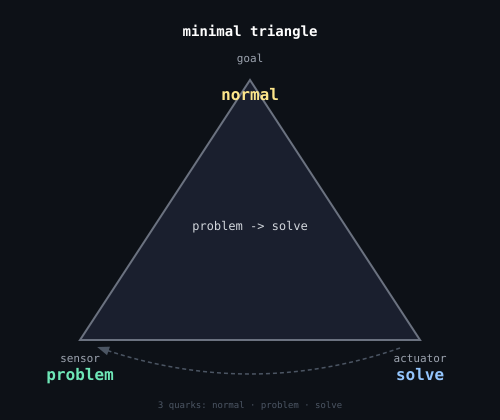

# lightblue — triangle template

A reusable template for building adaptive systems using quarks, triangles, and a Q-table matcher. Based on the [orange](https://github.com/PyramidAGI/orange) project.

## The minimal triangle



Three quarks are enough to describe any corrective system: `problem` at the sensor, `solve` as the wire, `normal` as the goal. The loop runs until the goal is reached — then resets.

## How to start a new project

**1. Define your domain** — fill in the three template slots:

```
goal:     normal      ->  what does "done" look like?
sensor:   problem     ->  what do you observe when things are wrong?
actuator: solve       ->  what action do you take?
```

**2. Create triangle files** in `triangles/` using the log format:

```
;;;;;;;;
[description];c;activity;[entity];[context];;60;50;
;;;;;;;;
[sensor observation];a;stat;[entity1];[entity2];[quark];30;40;
;c;mode;[entity1];[entity2];[action];35;45;
;;;;;;;;
[goal description];c;activity;[entity];[context];goal [quark1]+[quark2];80;90;
;;;;;;;;
```

**3. Run the matcher:**

```
python rl_matcher.py
```

Enter quarks (comma-separated). The Q-table learns which triangle handles each quark combination best.

**4. Drive a triangle directly:**

```
python runner.py
```

Enter quarks one at a time. Rules fire, goal is tracked.

**5. Map new concepts to quarks:**

```
python quark_overlap.py
```

Uses the OpenAI API to map any concept to the 39 base quarks + complement quarks.

## Files

| file | purpose |
|---|---|
| `numbered quarks.csv` | 39 base quarks |
| `complement quarks.csv` | quarks #40–#65 (stat*, bond, mode, etc.) |
| `combinations.csv` | concept → quark cache, grows by use |
| `blacklist.txt` | stop words filtered before quark lookup |
| `log.csv` | observation trace in semicolon format |
| `quark_overlap.py` | CLI: map concept to quarks via LLM |
| `concept_match.py` | CLI: find commonality between concepts |
| `build_triangle.py` | CLI: map observations to quarks, save to log |
| `runner.py` | CLI: execute triangles from log.csv |
| `rl_matcher.py` | CLI: RL-based triangle selector from triangles/ |
| `minimal_triangle_svg.py` | generates minimal_triangle.svg |
| `triangles/` | one CSV per triangle, loaded by rl_matcher |

## The quark system

39 universal semantic primitives that can describe any domain. See [orange](https://github.com/PyramidAGI/orange) for the full architecture, philosophy, and examples.
